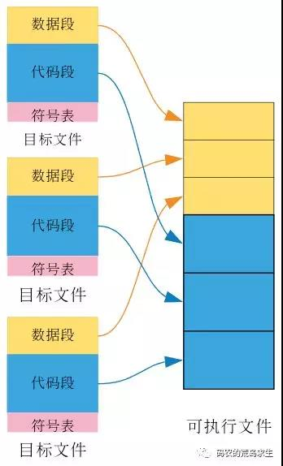

<h2>函数指针<h2>
<h3>函数原型</h3>
函数的声明，包含函数名字，返回类型以及形参类型。
想调用某函数，在调用之前一定要有函数的声明
<h3>声明</h3>

- 声明一个函数指针只需要将指针名替换函数名
- ```c++
  Bool (*pf) (const string& const string&)
  ```
- pf是个指针，pf左侧是指向的函数返回值类型，右侧是指向的函数形参列表
- (*pf)的**括号必不可少**，如果没有括号 ```Bool *pf (const string& const string&)```就变成了一个函数，返回一个bool*

<h3>赋值</h3>

- pf=functionName
- pf = &functionName
- 可以为函数指针初始化为nullptr或者0
<h3>调用函数</h3>

1. pf(param1,param2);
2. (*pf)(param1,param2)

<h3>函数指针形参</h3>
函数指针形参可以有如下定义
```cpp
//1
void funcWithFuncPtr(void pf(char*));
//2
void funcWithFuncPtr(void (*pf)(char*));
```

这样看来声明定义一个带有函数指针的函数还是有些麻烦的，冗长的代码会造成阅读困难
我们可以使用类型别名和decltype来简化我们使用的代码
```c++
typedef void FuncType(int*);
typedef decltype(func2) func2Type;

cout << "func2Type:" << typeid(func2Type).name() << endl;
cout << "FuncType:"<< typeid(func2Type).name() << endl;
```
然而FuncType和Func2Type都是函数类型，我们需要在类型前加上*才可以得到函数指针类型，如下
```c++
typedef void (*FuncType)(int*);
typedef decltype(func2) *func2Type;

cout << "func2Type:" << typeid(func2Type).name() << endl;
cout << "FuncType:"<< typeid(func2Type).name() << endl;
```
**!!!decltype只会返回函数类型，不会将函数类型自动转换成指针类型**

<h3>函数指针返回值</h3>
```c++
int (*f1(int)) (int*,int);
```
我们可以从内向外看，f1有形参列表所以是一个函数，左侧有个*符号，说明返回值返回一个指针。再看外侧，该指针是个函数指针类型，因此该方法是返回一个函数指针

为了方便阅读我们使用类型别名的方式去定义函数指针返回值

```c++
int func(int*);
using F = int(int*);    //F是函数类型不是指针
typedef int F1(int*);
typedef decltype(func) F2;

using PF = int(*)(int*); //PF是指针类型
typedef int (*PF1)(int*);
typedef decltype(func) *PF2;


F* f1();
F1* f2();
F2* f3();

PF f4();
PF1 f5();
PF2 f6();
int main()
{
    int i = 0;
    int* ip = &i;
    cout << "f1:" << f1()(ip) << endl;
    cout << "f2:" << f2()(ip) << endl;
    cout << "f3:" << f3()(ip) << endl;
    cout << "f4:" << f4()(ip) << endl;
    cout << "f5:" << f5()(ip) << endl;
    cout << "f6:" << f6()(ip) << endl;
}

int func(int* ip) {
    static int i = 10;
    return ++i;
}

F* f1() {
    return func;
}
F1* f2() {
    return func;
}
F2* f3() {
    return func;
}

PF f4() {
    return func;
}
PF1 f5() {
    return func;
}
PF2 f6() {
    return func;
}

```
当然，我们还可以使用尾置返回类型 
```c++
auto f1(int)->int(*)(int*);************
```

<h3>返回数组的函数声明？？</h3>
<h3>尾置返回类型？？</h3>

<h3>类</h3>


<h3>链接装载与库</h3>


<h4>符号表</h4>
<h4>静态链接</h4>
windows下是*.lib
Linux下是*.a

<h6>静态链接</h6>

静态链接库实际上就是各种目标文件的打包集合。会在链接的过程中和程序集一起打包成**可执行文件**

<h6>可执行文件</h6>

可执行文件也含有代码段，数据段组成。

**可执行文件有个入口Main函数，目标文件没有这个入口**

静态链接发生在编译中的**链接阶段**

- 每个目标文件中的数据段都合并到了可执行文件的数据段
- 每个目标文件当中的代码段都合并到了可执行文件的代码段。
-目标文件当中的符号表并没有合并到可执行文件当中


<h6>举例</h6>

借用**码农的荒岛求生**微信公众号的例子：静态链接好比你得论文引用了其他的文章，你直接把他们的文章直接拷贝到你自己的论文里

<h6>静态库的问题</h6>
如果有一个静态库所有的程序都要用到，那么所有程序的可执行文件中都要有这个静态库的备份，这是对硬盘&内存的极大浪费
<h4>动态链接</h4>

动态库链接可以解决这个问题，动态库也是库，也包含 **代码段，数据段，符号表**

<h6>动态链接</h6>
动态库允许使用该库的可执行文件仅包含动态库的引用信息，不需要直接将动态库拷贝到可执行文件内。


windows下是*.dll
Linux下是lib*.so

---

<h5>加载时动态链接</h5>

把 ***可执行文件复制到内存后，且在程序开始运行之前***，操作系统会查找 ***可执行文件依赖的动态库信息***(主要是动态库的名字以及存放路径)，找到该动态库后就将该动态库从磁盘搬到内存，并进行符号决议

***该方式依赖于在生成可执行文件的时候将动态链接库的信息（名字&地址）放到可执行文件内***


<h6>举例</h6>
加载时动态链接好比你在论文中加上其他大佬的著作引用，到时候直接通过引用的链接直接就能看到其他大佬的文章。

---

<h5>运行时动态链接</h5>

运行时动态链接这种方式对于“动态链接”阐释的更加淋漓尽致，因为可执行文件在启动运行之前都不知道需要依赖哪些动态库，只在运行时根据代码的需要再进行动态链接

在代码当中如果需要使用某个动态库所提供的函数，我们可以使用特定的API来运行时加载动态库，在Windows下通过 **LoadLibrary** 或者 **LoadLibraryEx**，在Linux下通过使用 **dlopen 、dlsym 、dlclose** 这样一组函数在运行时链接动态库。
首先去找这些动态库，将其从磁盘copy到内存，然后查找程序依赖的函数是否在动态库中定义。


<h6>举例</h6>
运行时动态链接好比你在论文中需要用到参考文献的时候，直接去查找资料，找到内容后再继续回来写文章。

---

之前我们把暂且可执行文件布局分为代码段，数据段。在动态链接下，会新增两段动态链接需要的**必要信息**


<h7>dynamic段</h7>
dynamic段中保存了可执行文件**依赖哪些动态库**，**动态链接符号表的位置**以及**重定位表的位置等信息**
<h7>GOT（Global offset table）</h7>


<h4>静态库的优缺点</h4>
<h5>缺点</h5>
1.如果常用静态库被很多程序以来的话，会造成磁盘空间浪费
2.静态链接会导致可执行文件过大

<h4>动态库的优缺点</h4>
<h5>优点</h5>
1.动态库不需要在编译期将库复制到可执行文件中，所以会解决磁盘空间浪费问题
2.如果我们修改了动态库代码，只需要编译动态库即可
<h5>缺点</h5>
1.动态库是程序加载时或运行是才进行链接的，因此同静态链接相比，使用动态链接的程序在性能上要稍弱于静态链接，
2.如果可执行文件引用的动态库没有被提供，是无法执行程序的